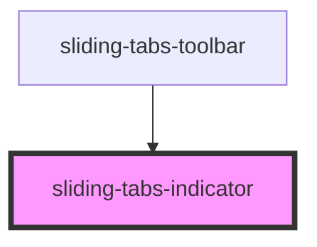

# sliding-tabs-indicator

<!-- Auto Generated Below -->

## Events

| Event                        | Description | Type               |
| ---------------------------- | ----------- | ------------------ |
| `slidingTabsIndicatorLoaded` |             | `CustomEvent<any>` |

## Methods

### `movePanIndicator(percentage?: number) => Promise<void>`

#### Returns

Type: `Promise<void>`

### `setButtons(buttons: HTMLElement[]) => Promise<void>`

#### Returns

Type: `Promise<void>`

## Dependencies

### Used by

 - [sliding-tabs-toolbar](../sliding-tabs-toolbar)

### Graph

----------------------------------------------

*Built with [StencilJS](https://stenciljs.com/)*
