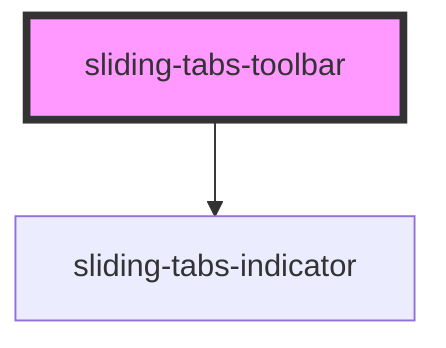

# sliding-tabs-toolbar

<!-- Auto Generated Below -->

## Properties

| Property             | Attribute             | Description | Type                            | Default     |
| -------------------- | --------------------- | ----------- | ------------------------------- | ----------- |
| `activeTabPosition`  | `active-tab-position` |             | `"center" \| "left" \| "right"` | `undefined` |
| `indicatorPlacement` | `indicator-placement` |             | `"bottom" \| "top"`             | `undefined` |
| `scrollable`         | `scrollable`          |             | `boolean`                       | `undefined` |

## Events

| Event                      | Description | Type               |
| -------------------------- | ----------- | ------------------ |
| `slidingTabsToolbarLoaded` |             | `CustomEvent<any>` |

## Methods

### `movePanIndicator(val?: number) => Promise<void>`

#### Returns

Type: `Promise<void>`

### `scrollToButton(name: string) => Promise<void>`

#### Returns

Type: `Promise<void>`

### `scrollToLeft() => Promise<void>`

#### Returns

Type: `Promise<void>`

### `scrollToPrevious() => Promise<void>`

#### Returns

Type: `Promise<void>`

### `scrollToRight() => Promise<void>`

#### Returns

Type: `Promise<void>`

### `setActiveTab(name: string, index?: number) => Promise<void>`

#### Returns

Type: `Promise<void>`

## Dependencies

### Depends on

- [sliding-tabs-indicator](../sliding-tabs-indicator)

### Graph

----------------------------------------------

*Built with [StencilJS](https://stenciljs.com/)*
